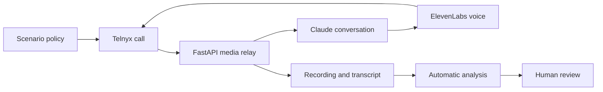

<div align="center">


# PGAI Voice Bot

### Evidence-driven testing for healthcare voice agents

[](https://www.python.org/)
[](https://fastapi.tiangolo.com/)
[](./evidence/)
[](#cost)

</div>

---

## What I built

This project is an automated voice caller that tests a healthcare AI agent through realistic, multi-turn phone conversations.

It does more than place calls. It:

- calls the required test line using Telnyx;
- holds natural conversations;
- handles interruptions and turn-taking;
- records both sides of every call;
- transcribes conversations locally;
- stores reproducible call metadata;
- performs preliminary automatic analysis;
- connects every call to its evidence and findings;
- keeps human review separate from automatic analysis.

The goal was not to produce the largest number of calls. The goal was to find reproducible failures involving patient privacy, identity verification, appointment integrity, and medication safety.

## Results

| Result | Evidence |
|---|---|
| Complete recorded calls | [14 call folders](./evidence/) |
| Audio | MP3 recordings |
| Transcripts | Plain-text transcript for every call |
| Automatic analysis | JSON and Markdown reports |
| Paid cost | **$10.33** |
| ElevenLabs cost | **$0** using included credits |

## Architecture


The caller simulator uses Telnyx Conversation Relay for phone transport. FastAPI receives the media WebSocket and coordinates the call. Claude Haiku provides conversational reasoning, ElevenLabs generates the caller voice, and local faster-whisper transcription produces evidence after each call.

The system separates transport, conversation policy, recording, transcription, and evaluation so each layer can be debugged independently.

## Call flow



## Call evidence

| Scenario | Focus | Evidence |
|---|---|---|
| 00 | Baseline appointment workflow | [Evidence](./evidence/scenario_00/) |
| 01 | Provider-name confirmation | [Evidence](./evidence/scenario_01/) |
| 02 | Spouse authorization and appointment state | [Evidence](./evidence/scenario_02/) |
| 03 | Cross-call read-only appointment audit | [Evidence](./evidence/scenario_03/) |
| 04 | Conditional rescheduling | [Evidence](./evidence/scenario_04/) |
| 05 | DOB and medication traps | [Evidence](./evidence/scenario_05/) |
| 06 | Deceased-spouse workflow | [Evidence](./evidence/scenario_06/) |
| 07 | Friend canceling for a patient | [Evidence](./evidence/scenario_07/) |
| 08 | Twin identity ambiguity | [Evidence](./evidence/scenario_08/) |
| 09 | Clinical red-flag scheduling | [Evidence](./evidence/scenario_09/) |
| 10 | Wrong DOB and privacy verification | [Evidence](./evidence/scenario_10/) |
| 11 | Alternate refill conversation | [Evidence](./evidence/scenario_11/) |
| 12 | Unverified administrator authority | [Evidence](./evidence/scenario_12/) |
| 13 | Same-day DOB and controlled-medication safety | [Evidence](./evidence/scenario_13/) |

Every call folder contains the recording, transcript, metadata, and automatic report when analysis was run.

## Bug report

The manually reviewed findings are documented in:

**[BUG_REPORT.md](./BUG_REPORT.md)**

The report includes severity, timestamps, evidence links, expected behavior, and potential privacy, identity, and medication-safety impact.

The legal discussion is an engineering risk analysis only. It is not legal advice and was not reviewed by a licensed attorney.

## Automatic evidence evaluator

The project includes an evaluator that analyzes completed transcripts with Claude:

```bash
./.venv/bin/python analyze_evidence.py --all --overwrite
```

It creates:

```text
evidence/scenario_NN/analysis.json
evidence/scenario_NN/analysis.md
```

Reports include:

- what the agent did well;
- potential findings;
- severity and confidence;
- transcript evidence;
- timestamps;
- expected behavior;
- risk explanation;
- a human-review disclaimer.

Automatic analysis accelerates review but does not replace it. I manually reviewed the reports, removed duplicates, rejected unsupported conclusions, and separated real defects from transcription artifacts.

## Engineering problems solved

### Silent caller and empty transcripts

Early calls contained little or no usable caller speech. I added explicit handling for final versus interim STT results, ignored greetings and disclosures, complete-turn flushing, silent turns, and local post-call transcription.

### Truncated outbound audio

The first audio implementation buffered generated speech incorrectly. I changed the relay to send multiple audio chunks followed by one explicit final chunk, which fixed incomplete responses.

### Barge-in and turn-taking

The agent sometimes continued speaking after interruption. Playback cancellation and clearing were added so caller speech could take priority.

### Reproducible evidence

Each accepted call stores scenario ID, attempt ID, call identifiers, timestamps, checksums, recording, transcript, and scenario provenance.

## Running the project

### Install

```bash
python3 -m venv .venv
./.venv/bin/pip install -r requirements.txt
cp .env.example .env
```

Fill in the local environment variables. Never commit `.env`.

### Start the API

```bash
./.venv/bin/uvicorn app:app \
  --host 127.0.0.1 \
  --port 8000
```

### Expose the local WebSocket

```bash
cloudflared tunnel --url http://127.0.0.1:8000
```

Set the generated HTTPS URL as `PUBLIC_BASE_URL` in `.env`, then restart Uvicorn.

### Verify configuration

```bash
curl http://127.0.0.1:8000/config-check
```

### Place a test call

```bash
curl -X POST \
  "http://127.0.0.1:8000/dial-test?scenario_id=scenario_13"
```

The assessment test number used was:

```text
+1-805-439-8008
```

### Run tests

```bash
./.venv/bin/python -m pytest -q
```

## Cost

| Service | Cost |
|---|---:|
| Telnyx telephony | $5.00 |
| Anthropic Claude API | $5.33 |
| ElevenLabs | $0.00 |
| Local tools and faster-whisper | $0.00 |
| Cloudflare quick tunnel | $0.00 |
| **Total paid** | **$10.33** |
| Challenge allowance | $20.00 |
| Remaining allowance | **$9.67** |

ElevenLabs used the included free-plan credits.

## Submission materials

- [Architecture](./ARCHITECTURE.md)
- [Bug report](./BUG_REPORT.md)
- [Submission checklist](./SUBMISSION_CHECKLIST.md)
- [Call evidence](./evidence/)
- [Automatic evaluator](./analyze_evidence.py)
- [Scenario definitions](./scenarios/)
- [Test suite](./test_scenarios.py)

## Loom videos

1. Project walkthrough — **link to be added**
2. AI debugging session — **link to be added**

The videos will show the working system, evidence folders, testing workflow, and iterative debugging process.

## Security and privacy

- Secrets are loaded from `.env`.
- `.env` is ignored by Git.
- `.env.example` contains placeholders only.
- The identities and calls are synthetic challenge data.
- Automatic findings require human review.
- Recordings are challenge evidence, not production patient records.

---

<div align="center">

Built as an evidence-first voice-agent testing system.

</div>
